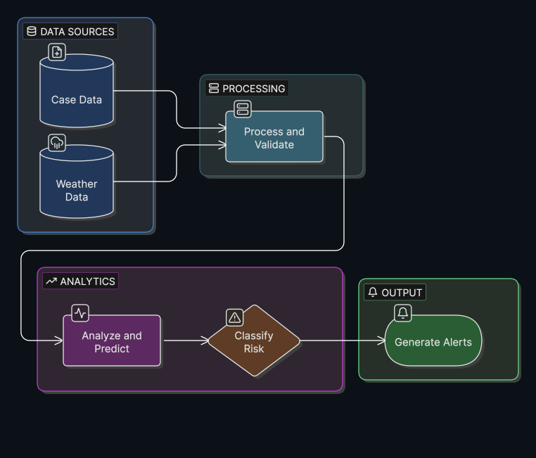

# acestor

**acestor** is a production dengue intelligence system built around three pipelines:

| Pipeline | Purpose |
|---|---|
| **`dengue_prep`** | Downloads and prepares raw case and weather data into `prepared_data/` |
| **`dengue`** | Reads from `prepared_data/`, runs forecasting models, produces maps and reports |
| **`dengue_downscale`** | Disaggregates district-level predictions to mandal (or sub-district) level |

All three are driven from YAML config files and can be run independently or chained together.

---

<p align="center">
  
</p>


## Table of Contents

1. [Prerequisites](#prerequisites)
2. [Installation](#installation)
3. [Running the pipelines](#running-the-pipelines)
4. [Scheduling pipelines](#scheduling-pipelines)
5. [Configuration guide](#configuration-guide)
6. [Pipeline stages](#pipeline-stages)
7. [Project layout](#project-layout)
8. [Development](#development)
9. [Architecture](docs/Architecture.md)
10. [dengue_prep pipeline](docs/DENGUE_PREP.md)
11. [Running & scheduling pipelines](docs/RUNNING_PIPELINES.md)
12. [Downscale pipeline & visualization](docs/downscale.md)
13. [Config reference](docs/CONFIG_REFERENCE.md)
14. [Troubleshooting](docs/TROUBLESHOOTING.md)

---

## Prerequisites

Before anything else, make sure you have:

- **Python 3.10+** — [python.org](https://www.python.org/downloads/)
- **uv** — fast Python package manager ([install guide](https://docs.astral.sh/uv/getting-started/installation/))
- **Geospatial system libraries** — required for `geopandas` / `shapely`:
  - **Mac**: `brew install gdal proj geos`
  - **Linux (Debian/Ubuntu)**: `apt-get install gdal-bin libgdal-dev libgeos-dev libproj-dev`
  - **Windows**: install [OSGeo4W](https://trac.osgeo.org/osgeo4w/) or use WSL
- **pdflatex** *(optional)* — only needed if `report.compile_pdf: true` in your config

---

## Installation

**1. Clone the repo**

```bash
git clone https://github.com/dsih-artpark/acestor.git
cd acestor
```

**2. Install dependencies**

```bash
uv sync --extra dengue --extra cds --extra s3
```

| Extra | What it adds |
|-------|-------------|
| `dengue` | Geospatial + modeling stack (geopandas, scikit-learn, etc.) |
| `cds` | Copernicus CDS weather downloads |
| `s3` | AWS S3 storage backend |

**3. Set up environment variables**

Copy the example env file and fill in your secrets:

```bash
cp .env.example .env   # if it exists, otherwise create .env manually
```

At minimum, set these if you use CDS downloads or email notifications:

```
CDS_API_KEY=your-key-here
SMTP_PASSWORD=your-password-here
```

> Secrets in YAML configs use `${VAR:-default}` syntax — never commit real keys.

---

## Running the pipelines

Run `dengue_prep` first to prepare data, then `dengue` to produce a forecast.
For full details — including how to chain them and schedule both — see **[docs/RUNNING_PIPELINES.md](docs/RUNNING_PIPELINES.md)**.

### Quick start

```bash
# Step 1 — prepare data
uv run python -m acestor.run \
  --pipeline pipelines.dengue_prep.pipeline:build_pipeline \
  --config configs/ap_district_prep.yaml

# Step 2 — run forecast
uv run python -m acestor.run \
  --pipeline pipelines.dengue.pipeline:build_pipeline \
  --config configs/ap_district.yaml \
  --run-id my-first-run
```

- `--pipeline` — points to the pipeline builder function
- `--config` — your YAML config file
- `--run-id` — any string to identify this run; outputs go under `{artifacts_base}/{run-id}/`

Exit code `0` = success, non-zero = failure.

### Using Make

```bash
make run-dengue-pipeline DENGUE_RUN_ID=my-run

# With a custom config:
DENGUE_CONFIG=configs/ap_district.yaml make run-dengue-pipeline DENGUE_RUN_ID=my-run

# Incremental/staged graph (faster, for testing):
make run-dengue-pipeline-incremental DENGUE_RUN_ID=smoke-001
```

### Inspecting outputs

Outputs land under `{storages.artifacts.filesystem.base_path}/{run_id}/`:

```
{run_id}/
  predictions/
  plots/
  reports/
  results/     ← zipped LaTeX bundle, maps zip
```

---

## Scheduling pipelines

Use `scripts/run_schedules.py` to run one or more pipelines on a recurring schedule.

### 1. Configure your pipelines

Edit the `PIPELINES` list at the top of [scripts/run_schedules.py](scripts/run_schedules.py):

```python
PIPELINES = [
    {
        "name":     "gba-weekly",
        "cron":     "0 6 * * 1",   # every Monday at 06:00 UTC
        "pipeline": "pipelines.dengue.pipeline:build_pipeline",
        "config":   "configs/gba_stage1_s3.yaml",
    },
    # add more pipelines here
]
```

Cron expression format: `minute  hour  day  month  day_of_week`

| Example | Meaning |
|---------|---------|
| `0 6 * * 1` | Every Monday at 06:00 UTC |
| `0 8 * * *` | Every day at 08:00 UTC |
| `*/30 * * * *` | Every 30 minutes |

### 2. Run the scheduler

**Foreground** (useful for testing):
```bash
uv run python scripts/run_schedules.py
```

**Background — Mac/Linux:**
```bash
nohup uv run python scripts/run_schedules.py > .acestor/scheduler.out 2>&1 &
echo $!   # prints the PID — save it to stop the scheduler later
```

**Background — Windows:**
```powershell
Start-Process pythonw -ArgumentList "scripts\run_schedules.py" -WindowStyle Hidden
```

**Stop the scheduler (Mac/Linux):**
```bash
kill <PID>
```

### 3. View logs

Each run writes its own log file:

```
logs/
  gba-weekly/
    run-20260327_060000.log
    run-20260403_060000.log
```

Watch a run live:
```bash
tail -f logs/gba-weekly/run-20260327_060000.log
```

List all runs for a pipeline:
```bash
ls -lht logs/gba-weekly/
```

> If the scheduler was briefly down and missed a scheduled run, it will catch up automatically (within a 1-hour grace window).

### Deployment

For production deployment on Docker or AWS EC2 — including systemd setup, IAM roles, S3 artifact storage, and log monitoring — see **[docs/DEPLOYMENT.md](docs/DEPLOYMENT.md)**.

### Docker Image

A pre-built Docker image is available on Docker Hub:

```bash
docker pull dsihartpark/acestor:latest
```

https://hub.docker.com/repository/docker/dsihartpark/acestor

Images are tagged by version (e.g., `dsihartpark/acestor:1.0.0`) and built automatically on every GitHub release tag.

---

## Configuration guide

Start from an example config in [`configs/`](configs/) — `gba_docker_test.yaml` is a good starting point.

For a full reference of every config key, see **[docs/CONFIG_REFERENCE.md](docs/CONFIG_REFERENCE.md)**.

### Key sections to edit

```yaml
pipeline:
  name: dengue
  title: "Dengue Intelligence"   # used in report titles

run:
  run_date: "2026-03-18"         # the reference date for this run

storages:
  artifacts:
    filesystem:
      base_path: "/path/to/outputs"   # where all run outputs are written

data:
  case_download:
    enabled: true
    source_path: "datasets/raw_linelist_data/..."

  geojson:
    base_path: "datasets/geojsons/geojsons_GBA"

email:                           # optional — run notifications
  enabled: false
  on: [success, failed]
  smtp_host: smtp.example.com
  to: [you@example.com]

report:
  compile_pdf: false             # set true if pdflatex is installed
```

### Environment variables in YAML

Use `${VAR}` or `${VAR:-default}` anywhere in the config — they are resolved at load time:

```yaml
email:
  smtp_password: "${SMTP_PASSWORD}"
```

---

## Pipeline stages

### dengue_prep

Steps execute in DAG order. Names match logs and code under `pipelines/dengue_prep/steps/`.

| # | Step | What it does |
|---|------|-------------|
| 1 | `download_case_data` | Locates raw case files (filesystem or S3) |
| 2 | `parse_case_data` | Parses IHIP files → daily case counts by region, upserts into `prepared_data/` |
| 3 | `download_weather_data` | Downloads weather from OpenMeteo, CDS, or pre-parsed source |
| 4 | `parse_weather_data` | Aggregates to daily weather features, upserts into `prepared_data/` |

### dengue

Steps execute in DAG order. Names match logs and code under `pipelines/dengue/steps/`.

| # | Step | What it does |
|---|------|-------------|
| 1 | `identify_sampling_day` | Resolves the case window and run metadata |
| 2 | `parse_case_data` | Loads prepared daily case series from `prepared_data/` |
| 3 | `validate_case_data_sufficiency` | Optional gate — stops early if data is too thin |
| 4 | `parse_weather_data` | Loads prepared daily weather features from `prepared_data/` |
| 5 | `identify_cutoff_dates` | Case/weather cutoffs and prediction calendar |
| 6 | `generate_thresholds` | Builds threshold tables from history + config |
| 7 | `train_and_predict` | Fits models, writes predictions |
| 8 | `combine_predictions` | Single combined predictions table |
| 9 | `assess_thresholds` | Threshold assessment + figure metadata |
| 10 | `generate_maps` | Choropleth map PNGs |
| 11 | `generate_report` | JSON + LaTeX bundle + maps zip + optional PDF |
| 12 | `notify_run` | Sends success email (if configured) |

### dengue_downscale

Runs after the `dengue` pipeline. Takes a completed forecast run ID and disaggregates
district-level predictions down to mandal (or any sub-district) level using recent case history.
See **[docs/downscale.md](docs/downscale.md)** for full run instructions.

| # | Step | What it does |
|---|------|-------------|
| 1 | `load_predictions` | Loads parent-level predictions CSV from a completed dengue run |
| 2 | `downscale_predictions` | Builds parent→child mapping from GeoJSONs, computes case-share weights, disaggregates |
| 3 | `write_output` | Writes `Predictions_downscaled_*.csv` to the downscale run's artifacts |

---

## Project layout

```
acestor-v2/
├── acestor/                  # Core runtime: config, orchestration, storage, CLI
├── pipelines/
│   ├── dengue_prep/          # Data preparation pipeline (download + parse)
│   ├── dengue/               # Forecast pipeline (model + maps + report)
│   └── dengue_downscale/     # Disaggregation pipeline (district → mandal)
├── configs/                  # Example YAML configs (ap_district.yaml, ap_district_to_mandal.yaml, …)
├── docs/                     # Guides: Architecture, DENGUE_PREP, RUNNING_PIPELINES, downscale, …
├── scripts/
│   ├── run_schedules.py      # Multi-pipeline APScheduler process
│   ├── install_schedule.py   # Crontab installer (single-pipeline alternative)
│   └── downscale_viz/        # Interactive HTML visualization generator for downscale output
├── logs/                     # Per-run log files (created at runtime)
├── Dockerfile
└── pyproject.toml
```

---

## Development

```bash
# Install with dev extras
uv sync --all-extras

# Lint, format, test
make lint
make format
make test
```

Pre-commit hooks: `pre-commit install`

---

## Contact

For ARTPARK deployments and collaboration: [artpark.in](https://www.artpark.in/)
GitHub: [dsih-artpark/acestor](https://github.com/dsih-artpark/acestor)
Issues: [github.com/dsih-artpark/acestor/issues](https://github.com/dsih-artpark/acestor/issues)
