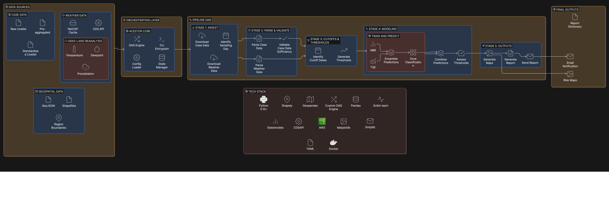

# Pipeline Architecture

> This page covers the **dengue** forecast pipeline.
> For the data preparation pipeline, see [DENGUE_PREP.md](DENGUE_PREP.md).
> For running and scheduling both together, see [RUNNING_PIPELINES.md](RUNNING_PIPELINES.md).

---

# Dengue Pipeline — Architecture

## Diagram

## Intermediates (per run, under `artifacts/{run_id}/`)

| Stage | Artifact | Format |
|---|---|---|
| Ingest | `sampling_day.json` | JSON |
| Parse | `datasets/cases_{region}_sampled.csv` | CSV |
| Parse | `datasets/weather_{region}_sampled.csv` | CSV |
| Cutoff | `cutoffs.json` | JSON |
| Threshold | `datasets/thresholds/{region}_all_thresholds.csv` | CSV |
| Modeling | `results/Predictions_{month}_{region}_{date}.csv` | CSV |
| Modeling | `dumps/best_method_{region}_{date}.csv` | CSV |
| Maps | `plots/{region}_{model}_{threshold}_{date}.png` | PNG |
| Maps | `results/AllMaps_{month}_{date}.zip` | ZIP |

---

## Final Outputs

| Output | Format | Destination |
|---|---|---|
| Risk maps | PNG choropleth | Artifacts dir + ZIP |
| Report dictionary | JSON | Artifacts dir |
| LaTeX report | `.tex` + PDF | Artifacts dir |
| LaTeX bundle | ZIP | Artifacts dir |
| Email notification | HTML + attachments | SMTP recipients |

---

## Tech Stack

| Layer | Technology |
|---|---|
| Language | Python 3.10+ |
| DAG/Orchestration | Custom (Kahn's algo + `ThreadPoolExecutor`) |
| Spatial | `geopandas`, `shapely` |
| Data | `pandas` |
| ML / Stats | `statsmodels` (NBR), `scikit-learn` |
| Weather API | `cdsapi` (Copernicus ERA5-Land) |
| Storage | Filesystem or `boto3` (S3) |
| Visualization | `matplotlib` + `geopandas` |
| Reporting | LaTeX + `pdflatex`, Python `smtplib` |
| Config | YAML + dataclasses, env-var substitution |
| Containerization | Docker |
