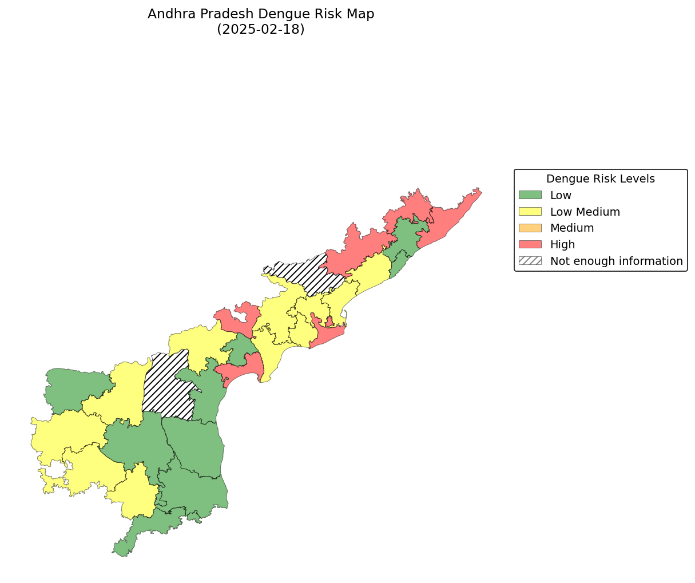
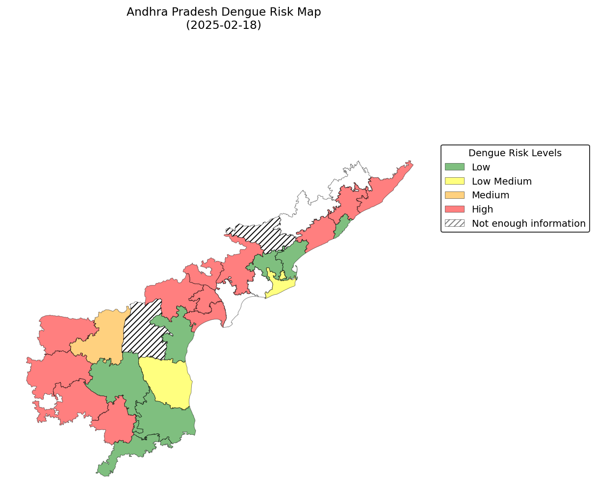

Output Format
=============

All outputs are written under ``{storages.artifacts.filesystem.base_path}/{run_id}/``.

Output Files
------------

.. list-table::
   :header-rows: 1
   :widths: 45 55

   * - Path
     - Description
   * - ``sampling_day.json``
     - Run metadata: resolved run date, sampling window
   * - ``datasets/cases_{region}_sampled.csv``
     - Case data trimmed to the modelling window
   * - ``datasets/weather_{region}_sampled.csv``
     - Weather features aligned to the modelling window
   * - ``datasets/thresholds/{region}_all_thresholds.csv``
     - Per-region threshold tables (both methods)
   * - ``cutoffs.json``
     - Case and weather cutoff dates, prediction calendar
   * - ``predictions/Predictions_*.csv``
     - District and state-level predictions
   * - ``plots/{region}_{model}_{threshold}_{date}.png``
     - Choropleth map images
   * - ``results/AllMaps_{month}_{date}.zip``
     - All map images bundled as a zip
   * - ``reports/*.json``
     - Structured report metadata
   * - ``reports/*.tex`` / ``reports/*.pdf``
     - LaTeX source and compiled PDF (if ``compile_pdf: true``)

Predictions File
----------------

Two prediction files are generated per run:

- ``Predictions_{MonthRange}_District_{Date}.csv`` — district-level
- ``Predictions_{MonthRange}_{State}_{Date}.csv`` — state-level aggregate

Example filenames:

.. code-block:: text

    Predictions_Apr - May 2026_District_20260407.csv
    Predictions_Apr - May 2026_Karnataka_20260407.csv

District-Level Columns
~~~~~~~~~~~~~~~~~~~~~~

.. list-table::
   :header-rows: 1
   :widths: 30 15 55

   * - Column
     - Type
     - Description
   * - ``district``
     - String
     - Region identifier (e.g. ``district_374``)
   * - ``recordDate``
     - Date
     - Date of the prediction record (``YYYY-MM-DD``)
   * - ``ISOWeek``
     - Integer
     - ISO week number
   * - ``thresholdMethod``
     - String
     - ``historical`` or ``previousNweeks``
   * - ``Mean``
     - Float
     - Historical mean of cases used for threshold
   * - ``StdDev``
     - Float
     - Historical standard deviation
   * - ``T0.00``
     - Float
     - Threshold tier 0 (baseline)
   * - ``T1.00``
     - Float
     - Threshold tier 1 (elevated)
   * - ``T2.00``
     - Float
     - Threshold tier 2 (high)
   * - ``startDatePredictedWeek``
     - Date
     - Start of the predicted ISO week
   * - ``dateOfComputingPrediction``
     - Date
     - Date the prediction was computed
   * - ``regionID``
     - String
     - Region identifier (same as ``district``)
   * - ``prediction``
     - Float
     - Predicted number of dengue cases
   * - ``model``
     - String
     - Model used (``ensembleModel``, ``NBR``, or ``TSE``)
   * - ``predictionZone``
     - Float
     - Zone classification based on threshold tiers

State-Level Columns
~~~~~~~~~~~~~~~~~~~

.. list-table::
   :header-rows: 1
   :widths: 35 15 50

   * - Column
     - Type
     - Description
   * - ``dateOfComputingPrediction``
     - Date
     - Date prediction was computed
   * - ``startDatePredictedWeek``
     - Date
     - Start of the predicted ISO week
   * - ``regionID``
     - String
     - State identifier (e.g. ``state_29``)
   * - ``prediction``
     - Float
     - Predicted cases for the state
   * - ``thresholdMethod``
     - String
     - Threshold method used
   * - ``predictionZone``
     - Integer
     - Alert zone (0 = low, higher = elevated risk)
   * - ``model``
     - String
     - Model used for prediction

Threshold Methods
-----------------

Two threshold methods are computed for each region and week:

- **historical** — based on the mean and standard deviation of historical cases (configurable lookback via ``thresholds.historical_n_years``)
- **previousNweeks** — based on the mean of the most recent N weeks (configurable via ``thresholds.n_weeks``)

Example Maps
------------

The ``generate_maps`` step produces choropleth PNGs showing dengue risk levels per district. Below are two example outputs from the same prediction week (week of 2025-02-18, Andhra Pradesh), one for each threshold method:

**Historical Thresholds**

**Previous N-Weeks Thresholds**

Prediction Zones
----------------

``predictionZone`` is a numerical classification of risk:

.. list-table::
   :header-rows: 1
   :widths: 20 80

   * - Zone
     - Meaning
   * - 0
     - Prediction below T0 (low / baseline)
   * - 1
     - Prediction between T0 and T1 (moderate)
   * - 2
     - Prediction between T1 and T2 (elevated)
   * - 3
     - Prediction above T2 (high)
